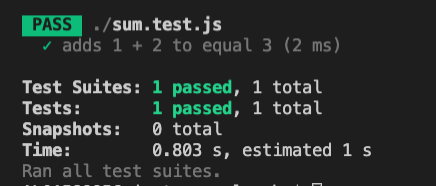
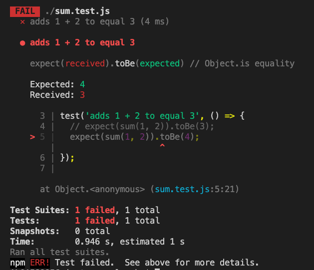

# Jest

[Jest](https://jestjs.io/en/)

> 페이스북에서 만든 Javascript 테스트 프레임워크
> babel, typescript, node, react, anguler, vue 프로젝트와 사용 가능.

##### jest 설치

> npm install --save-dev jest

`sum.js`

```js
function sum(a, b) {
  return a + b;
}
module.exports = sum;
```

테스트 코드 작성
`sum.test.js`

```js
const sum = require('./sum');

test('adds 1 + 2 to equal 3', () => {
  expect(sum(1, 2)).toBe(3);
});
```

- `expect` 와 `toBe`를 사용해 두 값이 동일한 지 테스트.

`package.json`

```json
{
  //...
  "script": {
    "test": "jest"
  }
}
```

실행
`npm run test`

실행 결과


expected에 4를 넣었을 때


---

#### [Globals](https://jestjs.io/docs/en/api)

`describe(name, fn)`
테스트 블록 형성. 범위 지정.

`test(name, fn, timeout)`
테스트 항목 만들기 . 테스트 코드를 돌리기 위한 API.

`it(name, fn, timeout)`
test와 동일

`beforeEach()`
모든 테스트 시작 전 함수 실행

#### [Mathcer](https://jestjs.io/docs/en/using-matchers)

- 테스트 값을 체크하기 위해 사용.

##### common Matchers

```js
test('two plus two is four', () => {
  expect(2 + 2).toBe(4);
});
```

`expect` : 테스트의 입력 값 or 기대값
`toBe` : 테스트의 예상 결과값

- 두 값이 같은 지 체크.
  `toEqual` : 객체 체크할 때 사용.

`not`
동일하지 않은 경우 체크

##### Truthiiness

- 값이 Truthy 한지, falsy 한지 체크.
- `toBeNull`
  `toBeUndefined`
  `toBeDefined`
  `toBeTruthy`
  `toBefalsy`

```js
test('null', () => {
  const n = null;
  expect(n).toBeNull();
  expect(n).toBeDefined();
  expect(n).not.toBeUndefined();
  expect(n).not.toBeTruthy();
  expect(n).toBeFalsy();
});

test('zero', () => {
  const z = 0;
  expect(z).not.toBeNull();
  expect(z).toBeDefined();
  expect(z).not.toBeUndefined();
  expect(z).not.toBeTruthy();
  expect(z).toBeFalsy();
});
```

##### Numbers

소수점 비교 시 사용. `toBeCloseTo`

```js
test('adding floating point numbers', () => {
  const value = 0.1 + 0.2;
  //expect(value).toBe(0.3);           This won't work because of rounding error
  expect(value).toBeCloseTo(0.3); // This works.
});
```

##### String

문자열 비교. 특정 정규표현식을 넣어서 문자열 확인
`toMatch`

```js
test('there is no I in team', () => {
  expect('team').not.toMatch(/I/);
});

test('but there is a "stop" in Christoph', () => {
  expect('Christoph').toMatch(/stop/);
});
```

##### Array and iterables

배열 또는 이터러블에 값이 포함되어 있는 지 확인.
`toContain`

```js
const shoppingList = ['diapers', 'kleenex', 'trash bags', 'paper towels', 'beer'];

test('the shopping list has beer on it', () => {
  expect(shoppingList).toContain('beer');
});
```

### Jest 환경 구성

### Jest 예제 코드 작성 및 정리

##### 참고 사이트

[Jest Getting Started](https://jestjs.io/docs/en/next/getting-started)
[Jest API Reference](https://jestjs.io/docs/en/api)
