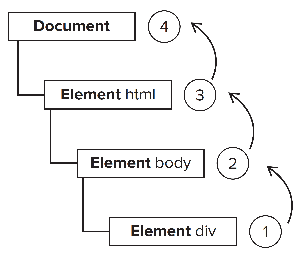
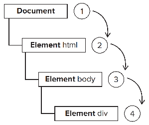
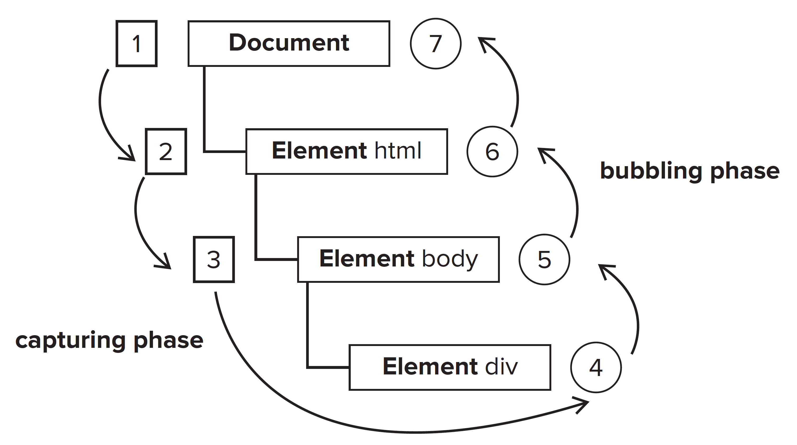

# 이벤트

> 1 이벤트 흐름에 대한 이해
> 2 이벤트 핸들러 다루기
> 3 여러 가지 타입의 이벤트

자바스크립트와 HTML의 상호작용은 문서나 브라우저 창에서 특정 순간 일어난 일을 가리키는 **이벤트**에 의해 처리됨.
이벤트는 '리스너'(핸들러) 로 추적하며 리스너는 이벤트가 일어날 때만 실행된다.

### 13.1 이벤트 흐름

**'이벤트 흐름'** : 페이지에서 이벤트가 전달되는 순서를 설명.

##### 이벤트 버블링

- 이벤트 흐름 상 문서 트리에서 가장 깊이 위치한 요소에서 시작해 거슬러 흐르는 모양이 마치 거품이 올라가는 것 같았기 때문.
- 인터넷 익스플로러의 이벤트 흐름.
- 최신 브라우저는 모두 이벤트 버블링을 지원.

```html
<!DOCTYPE html>
<html>
  <head>
    <title>Event Bubbling Example</title>
    <script type="text/javascript">
      window.onload = function () {
        window.onclick = function () {
          alert("Window");
        };

        document.onclick = function () {
          alert("Document");
        };

        document.documentElement.onclick = function () {
          alert("Html");
        };

        document.body.onclick = function () {
          alert("Body");
        };
        document.getElementById("myDiv").onclick = function () {
          alert("Div");
        };
      };
    </script>
  </head>
  <body>
    <div id="myDiv">Click Me</div>
  </body>
</html>
```

- div 요소 클릭 시 이벤트 발생 순서

1. `<div>`
2. `<body>`
3. `<html>`
4. `document`



- click 이벤트가 처음 발생하는 요소는 div, document 객체를 만날 때 까지 DOM트리를 거슬러 올라가면서 각 노드에서 모두 발생함.

##### 이벤트 캡처링

- 넷스케이프에서 만든 이벤트 흐름.
- 최상위 노드에서 처음으로 이벤트가 발생하며 가장 명시적인 노드에서 마지막으로 발생.
- 이벤트가 의도한 요소에 도달하기 전에 잡아채려는 목적으로 디자인됨.

- div 요소 클릭 시 이벤트 발생 순서

1. `document`
2. `<html>`
3. `<body>`
4. `<div>`
   

- 이벤트 캡처링에서는 click이벤트가 document에서 처음 발생하며, DOM 트리를 따라 내려가 이벤트 실제 대상인 `<div>`요소까지 전달됨.
- 오래된 브라우저에서는 이벤트 캡처링을 지원하지 않아 일반적으로 잘 쓰지 않음.
- 이벤트 버블링을 주로 쓰고 캡처링은 특별한 상황에서만 쓰는 것을 권장.

```html

```

##### DOM 이벤트 흐름

- DOM 레벨 2 이벤트에서 정의한 이벤트 흐름에는 **이벤트 캡처링 단계**, **타깃 단계**, **이벤트 버블링 단계** 세 가지가 있음.

1. 이벤트 캡처링 처음 발생.
2. 실제 타깃이 이벤트를 받음
3. 마지막으로 이벤트 버블링이 발생



- DOM 이벤트 흐름에서 실제 타깃 (div 요소)는 이벤트 캡처링 단계에서 이벤트를 전달받지 않음. 즉 캡처링 단계에서 이벤트는 document에서 `<html>`로 다시 `<body>`로 전달된 후 멈춤.
- 다음 단계는 타깃
- 이벤트 버블링이 발생하며, document까지 거슬러 올라감.

DOM 레벨 2 이벤트 명세에는 캡처링 단계에 이벤트 타깃에 이벤트가 전달되지 않는다고 되어있지만, 브라우저에서 캡처링 단계에 이벤트 타깃에 이벤트가 전달됨.

### 13.2 이벤트 핸들러

> 이벤트란? 사용자 또는 브라우저가 취하는 특정 동작.
> 이벤트에는 click이나 load, mouseover 같은 동작이 있음

- 이벤트 핸들러 (이벤트 리스너)
  - 이벤트에 응답하여 호출되는 함수
  - 이름은 **"on"** 으로 시작한다.
  - ex ) `click`이벤트의 이벤트 핸들러는 `onclick`

##### HTML 이벤트 핸들러

- 각 요소가 지원하는 이벤트는 이벤트 핸드러 이름을 HTML속성에 할당할 수 있다.
- 속성 값은 실행할 자바스크립트 코드여야함.

```html
<!-- HTML문법 문자를 사용하려면 이스케이프 처리 필요. -->
<input type="button" value="Click Me" onclick="alert('Clicked')" />
<input type="button" value="Click Me" onclick='alert("Clicked")' />
<script type="text/javascript">
  function showMessage() {
    alert("Hello world!");
  }
</script>
<input type="button" value="Click Me" onclick="showMessage()" />
<input
  type="button"
  value="Click Me"
  onclick="try{showMessage();}catch(ex){}"
/>
```

- attribute 값을 감싸는 함수가 생성된다.
- 함수 안에는 event라는 특별한 로컬 변수가 있고 이 변수는 이벤트 객체이다.
- 이벤트 객체를 직접 정의하거나 함수 매개변수 목록에서 추출하지 않아도 바로 사용.
- 함수 내부에서 this 값은 이벤트 타깃 요소와 일치함.

- 스코프 체인이 확장되는 방법
  - 함수 내부에서는 document 와 해당 요소의 멤버에 마치 로컬 변수처럼 접근할 수 있음.
  - with 문을 통해 이루어짐.

```js
function() {
  with(document){
    with(this){
      //속성값
    }
  }
}
```

- 이벤트 핸들러는 이를 통해 자신의 프로퍼티에 쉽게 접근 가능.
- 단점
  - 타이밍 문제. : 이벤트 핸들러 코드가 준비되기 전에 HTML요소가 화면에 나타나고 사용자가 이를 조작 할 가능성이 있음.
  - 이벤트 핸들러 스코프 체인 확장 결과가 브라우저마다 다르다.
  - HTML과 자바스크립트가 너무 단단히 묶임.

##### DOM레벨 0 이벤트 핸들러

- 자바스크립트에서 이벤트 핸들러를 할당하는 전통적인 방법.
- 이벤트 핸들러 프로퍼티에 함수를 할당함.
- 우선 객체에 대한 참조를 얻어야함.

- window와 document를 포함해 모든 요소에는 이벤트 핸들러 프로퍼티가 있음.
- onclick처럼 일반적으로 소문자.
- 이 프로퍼티를 함수로 설정하면 이벤트 핸들러가 할당됨.

```js
var btn = document.getElementById("myBtn"); // 버튼에 대한 참조를 얻음
// onclick 이벤트 핸들러 프로퍼티에 함수 설정.
btn.onclick = function () {
  alert(this.id);
};

var removeBtn = document.getElementById("myRemoveBtn");
removeBtn.onclick = function () {
  btn.onclick = null;
};
```

- 이벤트 핸들러는 해당 요소의 메서드로 간주.
- 이 이벤트 핸들러 요소의 스코프에서 실행되며, this는 요소 자체.
- 이벤트 핸들러 내부에서 this를 통해 요소의 프로퍼티나 메서드에 접근 가능.
- 이벤트 핸들러 제거

```js
btn.onclick = null;
```

- 이벤트 핸들러 프로퍼티를 null 로 설정함.

##### DOM레벨 2 이벤트 핸들러

- 이벤트 핸들러 할당과 제거를 담당하는 메서드 `addEventListener()`, `removeEventListener()` 정의.
- 메서드는 모든 DOM노드에 존재하며, 매개변수로 이벤트 이름, 이벤트 핸들러 함수, 이벤트 핸들러를 캡처 단계에서 호출할 지, 버블링 단계에서 호출할 지 나타내는 불리언 값 세 가지를 받음.

```js
var btn = document.getElementById("myBtn");
btn.addEventListener(
  "click",
  function () {
    alert(this.id);
  },
  false
);
btn.addEventListener(
  "click",
  function () {
    alert("Hello world!");
  },
  false
);
```

- 장점

  - 이벤트 핸들러를 **'추가'** 하므로 이벤트 핸들러가 여러 개 있을 수 있다.

- 이벤트 핸들러 제거
  - `addEventListener()`로 추가한 이벤트 핸들러는 **핸들러를 추가할 때와 같은 매개변수**를 넘기면서 `removeEventListener()`를 호출해야 제거 가능.

##### 인터넷 익스플로러 이벤트 핸들러

- `attachEvent()`, `detachEvent()`
- 이벤트 핸들러 이름과 이벤트 핸들러 함수 두 가지를 매개변수로 받음.
- IE8 이전 버전은 이벤트 버블링만 지원.

### 13.3 event 객체

> DOM과 관련된 이벤트가 발생하면 관련 정보는 `event`라는 객체에 저장됨.
> 이벤트가 발생한 요소, 이벤트 타입 같은 기본정보 + 이벤트와 관련된 다른 데이터.
> 모든 브라우저가 **event객체**를 지원함.

##### DOM event 객체 - [MDN Event](https://developer.mozilla.org/ko/docs/Web/API/Event)

- 이벤트 핸들러에 전달되는 매개변수는 `event객체` 하나 뿐임.
- 이벤트 객체에는 생성에 관여한 이벤트와 관련된 프로퍼티 및 메서드가 포함.
- 이벤트 핸들러 내부에서 `this객체`는 항상 `currentTarget`의 값과 일치.
- `target` 에는 이벤트의 실제 타깃만 포함됨.
- `type` 프로퍼티
  - 함수 하나에서 여러 이벤트를 처리할 때 유용.
- `preventDefault()`
  - 이벤트 기본 동작을 취소.
- `stopPropagation()`
  - 이벤트 흐름을 즉시 멈추어 이벤트 캡처링이나 버블링을 취소함.
- `eventPhase` 프로퍼티
  - 현재 이벤트가 어느 단계에 있는지.
    > 캡처 단계에서 호출 : 1
    > 타깃에서 호출 : 2
    > 버블링 단계에서 호출 : 3
  - `eventPhase`가 2 이면 this와 target, currentTarget은 항상 일치.
- 인터넷 익스플로러의 event 객체
  - DOM 표준의 event객체와 달리 인터넷 익스플로러의 event객체는 이벤트 핸들러를 어떻게 할당했느냐에 따라 다르게 접근.
    - DOM 레벨 0 접근법으로 할당 시 : event객체는 window객체의 프로퍼티로만 존재.
    - attachEvent()로 할당 시 : event 객체는 함수의 매개변수로 전달됨.

### 13.4 이벤트 타입

[MDN 이벤트 참조](https://developer.mozilla.org/ko/docs/Web/Events)

- UI 이벤트
- Focus 이벤트
- 마우스 이벤트와 휠 이벤트
- 키보드와 텍스트 이벤트
- 조합 이벤트
- matation event
- HTML5 이벤트
- 장치 이벤트
- 터치와 제스처 이벤트

### 13.5 메모리와 성능

- 이벤트 위임
- 이벤트 핸들러 제거

### 13.6 이벤트 시뮬레이션

- DOM 이벤트 시뮬레이션
- 인터넷 익스플로러의 이벤트 시뮬레이션

### 13.7 요약

- 이벤트는 자바스크립트와 웹 페이지를 연결하는 우선적인 방식이다.
- 공통 이벤트는 대부분 DOM레벨 3 이벤트 명세나 HTML5에 정의되어있음.
- 메모리와 성능
  - 이벤트 핸들러가 많을 수록 메모리가 많이 사용, 핸들러 개수를 제한하는 것이 좋음
  - 이벤트 위임은 이벤트 버블링의 장점을 활용하여 이벤트 핸들러 숫자를 제한
  - 페이지 언로드 전 페이지 추가했던 이벤트 핸들러 제거하기.
- 자바스크립트를 이용한 이벤트 시뮬레이션

##### 참고 링크

- [MDN 이벤트 참조](https://developer.mozilla.org/ko/docs/Web/Events)
- [이벤트](https://poiemaweb.com/js-event)
- [브라우저 이벤트 소개](https://ko.javascript.info/introduction-browser-events)
