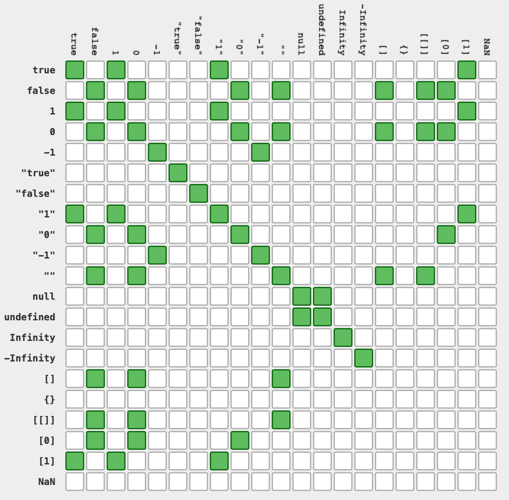

# 3장 언어의 기초

### 3.1 문법
 - 대소문자 구분
   - 변수, 함수 이름, 연산자 모두 대소문자를 구분함.
 - 식별자
   - 변수, 함수, 프로퍼티, 함수 매개변수의 이름.
   - 식별자 표기 방법
     - 첫번째 문자는 글자나 밑줄, 달러 기호 중하나
     - 유니코드 문자 사용 가능하지만 권장 안함.
     - 키워드와 예약어 사용 불가
     > 관습적으로 카멜 케이스를 사용한다.
      ECMAScript 내장 함수와 객체가 카멜 케이스로 표시하며, 카멜 케이스를 권장. 
 - *스트릭트 모드*
   - ECMAScript5 에서 스트릭트 모드라는 개념을 도입. 
   - 자바스크립트에서 에러가 자주 생기는 부분에 제약을 추가하여 안전하지 않은 동작에 에러를 반환해줌.
   - 전체 스크립트에 적용
     - `"use strict"`
   - 함수 내 적용
        ```js
        function doSomething() {
            "use strict";
            // 함수 본문
        }
        ```
 - 문장
   - 각 문장은 세미콜론으로 종료.
   - 여러 문장을 **코드 블록**으로 합칠 수 있음.
     - 코드 블록은 여는 중괄호로 시작해 닫는 중괄호로 끝남
     - 제어문에 코드 블록을 쓰면 좀 더 명확하게 표현 가능
### 3.2 키워드와 예약어
 - 키워드, 예약어는 식별자나 프로퍼티 이름에 사용 불가능.
 - 키워드
   -  제어문의 시작과 끝을 나타낸다던지, 특정한 조작 목적으로 사용.
 - 예약어
   - 아직은 쓰임새가 없지만 미래 키워드로 쓸 가능성이 있는 것.
 - [키워드, 예약어 목록](https://developer.mozilla.org/en-US/docs/Web/JavaScript/Reference/Lexical_grammar#Keywords)
 - 식별자 이름에 키워드를 쓰는 경우 ECMAScript 3 자바스크립트 엔진 에서 "Idenifier Expected" 에러 발생. 
 - 식별자 이름에 예약어를 쓰면 엔진에 따라 에러가 발생할 수도, 안할 수도 있음. 
  > 5판에서 키워드와 예약어를 객체의 프로퍼티 이름으로는 사용할 수 있게 되었지만, 호환성 보장을 위해 쓰지 않는걸 권함.

### 3.3 변수
 `var 연산자`  `변수 이름`;
 - ECMAScript는 느슨한 변수 타입을 사용.
 - 변수에 어떤 타입의 데이터라도 저장할 수 있음.
 - 변수에 저장된 값을 바꿀수 있고, 타입도 변경 가능.
 - 변수 초기화 하지 않을 때 특별한 값인 `undefined` 할당.
 - 변수 선언과 동시에 할당 가능.
    - `var message = "hi";`
  - 로컬 스코프 변수 선언 - 함수가 종료되는 즉시 파괴됨.
    ```js
    function test() {
        var message = "hi"; // 지역 변수
    }
    test();
    console.log(message) // 에러

    ```
 - var 연산자 생략하여 전역 변수 정의 가능.
    ```js
    function test() {
        message = "hi"; //전역 변수
    }
    test();
    console.log(message) // "hi"
    ```
    > strict 모드에서는 변수를 선언하지 않고 값을 할당하면 ReferenceError 반환.
### 3.4 데이터 타입
  - 원시 데이터 타입 (primitive)
    1. Undefined
    2. Null
    3. 불리언
    4. 숫자
    5. 문자열
  - 객체 타입 : 이름-값 쌍의 순서 없는 목록
  - `typeof` 연산자
    - 변수의 데이터 타입을 알아내야 할 때 사용.
    - typeof 연산자는 아래 6가지 문자열 중 하나 반환.
      - 정의되지 않은 변수 : `"undefined"`
      - 불리언 : `"boolean"`
      - 문자열 : `"string"`
      - 숫자 : `"number"`
      - 함수를 제외한 객체, null : `"object"`
      - 함수 : `"function"`
    - 사용 방법
      ```js 
      var message = "some string";
      console.log(typeof message);
      ```
  - **주의**: `typeof null` 은 `"object"`
    - null은 빈 객체를 참조하는 특별한 값이기 때문에 "object"를 반환한다.
- **undefined** 타입
  - 변수 정의 후 초기화하지 않으면 해당 변수에는 undefined 할당.
    ```js
    var message;
    console.log(message) // undefined
    ```
    > 변수에 undefined 를 지정하지 않아야 함. `undefined`는 빈 객체를 가리키는 null과 초기화되지 않은 변수를 비교할 목적으로 추가된 타입이기 때문.
  - `초기화되지 않은 변수` vs `정의되지 않은 변수` 
    - typeof 연산 시 같은 결과를 반환함.
    - ```js
        // 초기화하지 않은 변수
        var message;

        console.log(message) // undefined
        typeof message // "undefined"

        // 정의하지 않은 변수
        console.log(message2) // Reference 에러 발생
        typeof message2 // "undefined"
        ```
> 변수를 초기화 하지 않으면 자동으로 undefined가 할당되지만 항상 초기화 하는 습관을 들이기. 이렇게 하면 typeof가 undefined를 반환했을 때 초기화하지 않은 변수인지, 정의하지 않은 변수인지 바로 알 수 있다.

- **Null** 타입
  - `null` 값 하나만 갖는다.
  - 빈 객체를 가리키는 포인터이므로 **typeof 연산 시 "object" 반환.**
  - 변수 정의 시 객체를 가리키게 할 경우라면 null로 초기화 하기.
- 불리언 타입
  - true, false 두 가지 리터럴 값만 가짐.
  - ECMAScript에서는 모든 타입을 불리언 값으로 표현 가능.
  - `Boolean() `함수
    - 모든 타입을 불리언 값으로 표현 가능.
    - 불리언값 반환.
  - true로 변환되는 값 - [참 같은 값(truthy)](https://developer.mozilla.org/ko/docs/Glossary/Truthy)
    - true
    - 비어있지 않은 문자열
    - 0이 아닌 모든 숫자
    - 모든 객체
    - 
  - false로 변환되는 값 - [거짓 같은 값(Falsy, falsey)](https://developer.mozilla.org/ko/docs/Glossary/Falsy)
    - false
    - "" (빈 문자열)
    - 0, NaN
    - null
    - undefined
- 숫자 타입
  - ECMAScript에서는 IEEE-754형식을 통해 정수와 부동소수점 숫자를 나타냄.
  - 숫자 리터럴
    ```js
    var intNum = 55; // 10진법
    var octalNum1 = 070; // 8진법 56
    var hexNum1 = 0xA // 16진법 10
    var floatNum1 = 1.1 // 부동소숫점 숫자
    var floatNum2 = .1 // 부동소숫점 숫자. 권장 안함
    var floatNum3 = 3.125e7 // 지수표기법. 31,250,000
    ```

  - 숫자 범위
    - 메모리 제한으롤 모든 숫자를 나타낼 수 없음. 브라우저마다 최솟값, 최대값 등을 프로퍼티에 저장. 
    - Number.MIN_VALUE : 최소값
    - Number.MAX_VALUE : 최대값
    - Infinity : 양의 무한대
    - -Infinity : 음의 무한대
    - `isFinite()` 함수 
      - 어떤 값이 유한한지 확인하는 함수
  - **NaN** (Not a Number)
    - 숫자를 반환할 것으로 의도한 조작이 실패했을 때 반환하는 값. (에러 아님. 다른 언어에서는 일반적으로 에러)
    - `isNaN()` 함수
      - 해당 값이 "숫자가 아닌 값"인지 검사
      - NaN이 어떤 값과도 일치하지 않기 때문에 이 함수를 통해 확인해야함.
        - `NaN == NaN` 은 false
     > - isNaN 함수에 객체를 넘길 경우.
         1. 객체의 valueOf() 메서드를 호출 후 반환값을 숫자로 바꿀 수 있는 지 테스트.
         2. toString() 메서드 호출 후 반환값을 숫자로 바꿀 수 있는 지 테스트
  - 숫자 변환
    - `Number()`
      - 불리언 값 : true, false를 1,0으로 반환
      - null : 0
      - undefined : NaN 
    ```js
    var num1 = Number("Hello world") // NaN
    var num2 = Number("") // 0
    var num3 = Number("000011") // 11 . 리딩 제로 무시.
    var num4 = Number(true) // 1
    ```

  - `parseInt()`
     - Number() 함수 사용 시 복잡하고 이상한 규칙을 기억해야 하므로 정수 형태의 문자열을 숫자로 바꿀 때에는 parseInt()함수를 사용.
     - 숫자가 아닌 문자를 만날 때 까지 변환 진행.
     - 리딩 스페이스를 전부 버림
     - 10진수, 8진수, 16진수를 인식하고 그에 맞게 변환.
     - 첫 문자가 숫자나 +/-기호가 아니면 NaN을 반환.
     - 진법을 나타내는 두 번째 매개변수를 넣어서 사용도 가능.
    ```js
    
    var num1 = parseInt("1234blue");    //1234

    var num2 = parseInt("");            //NaN
    var num3 = parseInt("0xA");         //16진수 10
    var num4 = parseInt(22.5);          //22
    var num5 = parseInt("70");          //70 
    var num6 = parseInt("0xf");         //16진수 15 
    
    var num7 = parseInt("AF", 16);      //175
    var num8 = parseInt("AF");          //NaN
    ```
    - `parseFloat()`
      - `parseInt()`함수와 비슷.
      - 10진수 기준으로 파싱. 
      - 첫번째 소수점 까지만 유효
      - 소수가 아닌 경우 정수로 반환.
    ```js
    var num1 = parseFloat("1234blue");    //1234 - integer
    var num2 = parseFloat("0xA");         //0
    var num3 = parseFloat("22.5");        //22.5
    var num4 = parseFloat("22.34.5");     //22.34
    var num5 = parseFloat("0908.5");      //908.5
    var num6 = parseFloat("3.125e7");     //31250000
    ```
- 문자열 타입
  - 16비트 유니코드 문자의 연속, 큰 따옴표나 작은 따옴표로 감싸서 표현.
  - 문자 리터럴
  - 문자열 길이는 length 프로퍼티.
  - 불변성
    - 문자열 변경 시 새로운 문자열을 만듬.
  - `toString()`  (5장)
    - 값을 문자열로 바꾸는 메서드.
    - 숫자, 불리언, 객체, 문자열에 존재. 
    - null, undefined 에는 없음.
    - 진법 매개변수 사용 가능. 
        ```js
        var num = 10;
        console.log(num.toString());       //"10"
        console.log(num.toString(2));      //"1010"
        console.log(num.toString(8));      //"12"
        console.log(num.toString(10));     //"10"
        console.log(num.toString(16));     //"a"
        ```
    - `null`, `undefined` 일 가능성이 있으면 String() 형변환 함수 사용하기.
  - `String()` 함수
    - 문자열로 변환 할 값이 `null` 이나 `undefined`일 가능성이 있다면 형 변환 함수인 String() 사용.
    - 규칙
      - toString() 메서드 존재 시 이를 호출하여 반환
      - `null` 은 "null"
      - `undefined` 은 "undefined"
- 객체 타입 (5장, 6장)
  - 데이터와 기능의 집함.
  - Object 타입의 인스턴스는 Object 타입의 프로퍼티와 메서드를 전부 상속 받음. 
    - constructor
    - hasOwnProperty
    - isPrototypeOf
    - propertyIsEnumerable
    - toLocalString
    - toString
    - valueOf
### 3.5 연산자
 - 데이터 조작에 사용할 수 있는 여러가지 연산자가 존재하며, 문자열, 숫자, 불리언, 객체 등 폭 넓은 데이터를 조작 가능.


 - 산술 연산자
   - 숫자가 아닌 피연산자를 숫자 타입으로 변환함 (+, -,++, --, *, /, %, >, < 등)
      - 숫자로 바꿀 수 있는 문자열은 숫자로 바꿈. 변경 불가능할 땐  `NaN`
      - false : 0
      - true : 1
      - 객체 : 1.valueOf()  2.toString() 호출 후 숫자로 변경.

 - **불리언 연산자**
   - 논리 NOT `!`
     - 피연산자를 불리언으로 변환한 뒤 결과를 부정하여 반환.
        ```js
        alert(!false);      //true
        alert(!"blue");     //false
        alert(!0);          //true
        alert(!NaN);        //true
        alert(!"");         //true
        alert(!12345);      //false
        ```
   - 논리 AND `&&` , 논리 OR `||`
     - 피연산자가 불리언이 아닐 경우, 두 피연산자 중 결과를 결정하는 피연산자를 반환함 ( 불리언을 반환하지 않을 수 있다.)
     - 첫 번째 피연산자에서 결과를 결정할 수 있으면 두번째 피연산자를 평가하지 않음.
       - 정의되지 않은 `someUndeclaredVariable` 변수
        ```js
        var found = true;
        var result = (found && someUndeclaredVariable);    //error
        alert(result);    //this line never executes

        var found = false;
        var result = (found && someUndeclaredVariable);    //no error
        alert(result);    //works


        var found = true;
        var result = (found || someUndeclaredVariable);    //no error
        alert(result);    //works

        var found = false;
        var result = (found || someUndeclaredVariable);    //error 
        alert(result);    //this line never executes
        ```
    
 - 덧셈 연산자
   - 피연산자가 둘 다 숫자일 경우
     - 숫자 더하기 연산
   - 피연산자가 **문자열**인 경우
     - 둘 다 문자열이면 문자열 병합.
     - 하나만 문자열이면 나머지 피연산자를 문자열로 변환 후 문자열 병합
    ```js
    var result1 = 5 + 5;     //two numbers
    console.log(result1);    //10
    var result2 = 5 + "5";   //a number and a string
    console.log(result2);    //"55"
    ```
 - 관계 연산자
 - **동일 연산자**
   - 동일 연산자 `==`, 비동일 연산자 `!=`
     - 비교 전 강제 타입 변환.
     - 피연산자가 불리언일 경우 숫자로 변환. true:1, false:0
     - 문자, 숫자 일 경우 문자를 숫자로 바꾸는 시도
     - 하나가 객체면 valueOf메서드 호출.
    - 특별한 경우와 결과
       - null == undefined : **true**
       - undefined == 0 : **false**
       - null == 0 : **false**
       - "5" == 5 : true
       - NaN == NaN : false (NaN 은 isNaN으로 비교)
       - NaN !== NaN : true
   - 
   - 일치 연산자 `===` , 불일치연산자 `!==`
     - 동일, 비동일 연산자와 같은 일을 하지만 타입 변환을 하지 않고 있는 그대로 비교함.
### 3.6 문장
 - 제어문
 - if
 - do-while
 - while
 - for
 - `for-in`
   - 객체의 프로퍼티를 나열하는데 사용.
   - 프로퍼티에 순서가 없으므로 순서 예측 불가
   - 나열할 객체를 가리키는 변수가 null, undefined 인지 확인하는 게 좋음.
    ```js
    for (var propName in window) {
        document.write(propName);
        document.write("<br />");
    }
    ```
 - `with` 문
   - 스코프를 특정 객체에 고정.
   - 특정 객체를 자주 참조할 때 편리하게 사용하는 목적.
    ```js
    // location 객체를 매 행마다 참조
    var qs = location.search.substring(1);
    var hostname = location.hostname;
    var url = location.href;

    // 지역변수에서 식별자로 찾을 수 없으면 location 객체의 프로퍼티에서 검색
    with(location){
        var qs = search.substring(1);
        var hostName = hostname;     
        var url = href;
    }
    ```
    - > 스트릭트 모드에서 with문 금지. 성능에 악영향, 디버깅이 힘듬
 - `switch` 문
   - 모든 데이터 타입에서 동작 (대부분 언어에서 문자, 숫자 타입에서만 사용 가능)
   - 상수일 필요가 없고, 변수나 표현식도 사용 가능.
    ```js
    switch ("hello world") {
        case "hello" + " world":  // 문자열을 합치는 표현식
            console.log("Greeting was found."); // 실행
            break;
        case "goodbye": 
            console.log("Closing was found.");
            break;
        default: 
            console.log("Unexpected message was found.");
    }

    // num을 밖에 정의하고 case 문을 순서대로 평가하면서 true 인 것을 찾음 
    var num = 25;
    switch (true) {
        case num < 0: 
            console.log("Less than 0.");
            break;
        case num >= 0 && num <= 10: 
            console.log("Between 0 and 10.");
            break;
        case num > 10 && num <= 20: 
            console.log("Between 10 and 20.");
            break;
        default: 
            console.log("More than 20."); // 실행
    }
    ```
    > switch 문은 일치 연산자(`===`)로 값을 비교하므로 타입변환은 일어나지 않는다.
### 3.7 함수
 - `function` 키워드로 정의.
    ```js
    function addSomeNumber(num) {
    return num + 100
    }
    ```
 - 값을 반환하지 않아도 됨.
   - 값을 반환하지 않은 함수의 경우 undefined 반환
 > 항상 값을 반환하거나 항상 반환하지 않도록 하기. 반환에 일관성 유지 필요. 그렇지 않으면 디버깅 힘듬.
  - 스트릭트 모드 제한
    - 함수, 매개변수 이름에 `eval`, `arguments` 사용 불가
    - 중복된 매개변수명 사용 불가
 - 매개변수의 이해
   - 데이터 타입 체크 안함
   - 매개변수 갯수를 체크하지 않음.
   - 매개변수가 내부적으로 배열로 표현되기 때문. 
   - `arguments` 객체
     - 매개변수 값 접근
     - `length` 프로퍼티로 매개변수 갯수 확인
   - 오버로딩 불가능
     - 함수 내에서 매개변수의 종류나 타입에 따라 다르게 동작하도록 구현해야함.

###### 참고 링크
- https://dorey.github.io/JavaScript-Equality-Table/
- https://developer.mozilla.org/en-US/docs/Web/JavaScript/Reference/Lexical_grammar#Keywords
- https://developer.mozilla.org/ko/docs/Glossary/Truthy
- https://developer.mozilla.org/ko/docs/Glossary/Falsy