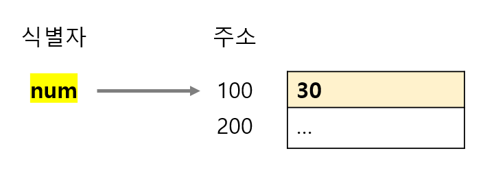
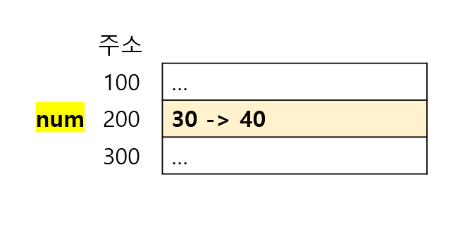
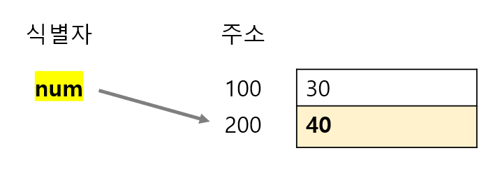
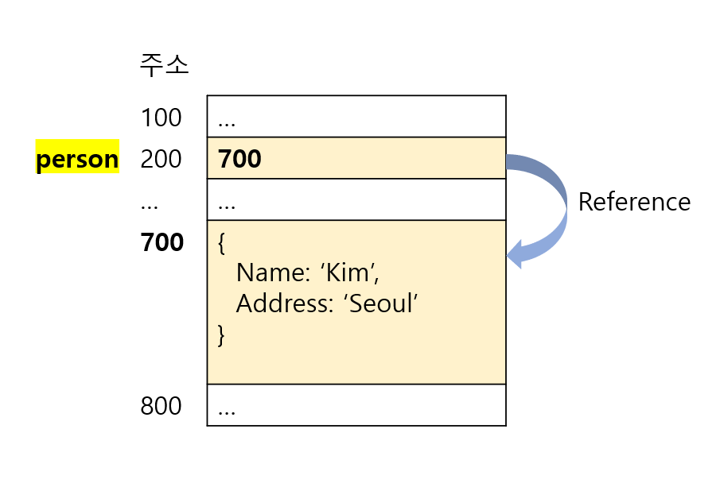
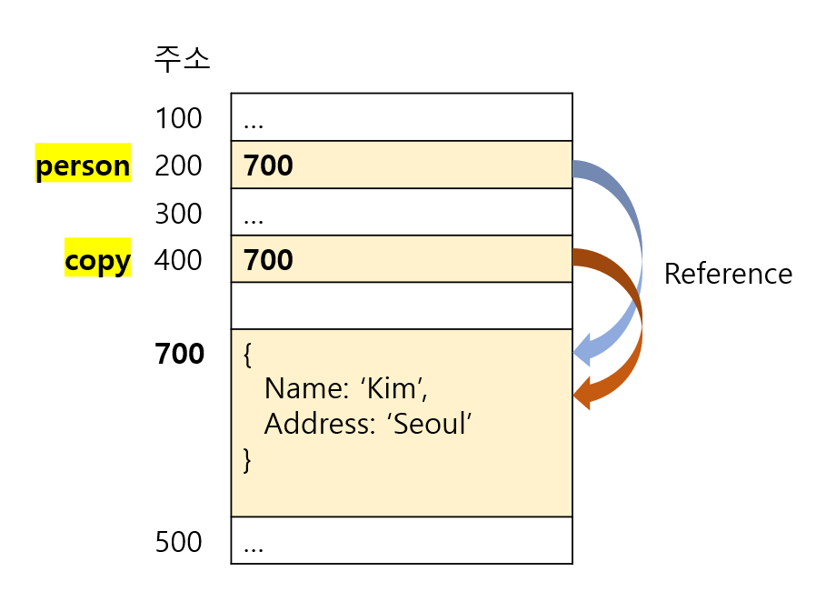
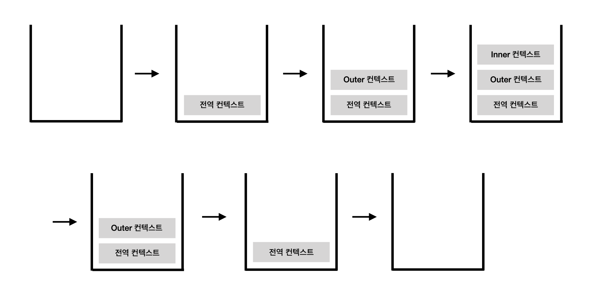
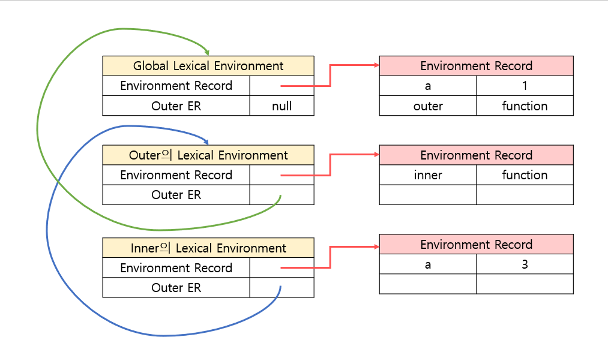

# 4장 변수와 스코프, 메모리

> 키워드 
    - 변수의 원시 값과 참조 값
    - 실행 컨텍스트
    - 가비지 컬렉션

- 변수 특징
  - 느슨한 타입을 취함
  - 데이터 타입의 규칙 없음.
  - 값과 타입이 실행 중 변경 가능.

### 4.1 원시 값과 참조 값
- **원시 값 (Primitive type)**
  - 단순한 데이터
  - Undefined, Null, 불리언, 숫자, 문자열 + ( Symbol )
  - "값으로" 접근한다. 실제 값을 조작 가능.
- 원시값 할당과 재할당
    - 엄격히 표현하면 변수에는 값이 전달되는 것이 아니라 메모리 주소가 저장됨.
    - 변수(식별자)는 값이 아니라 메모리 주소를 기억하고 있기 때문
   > 데이터 저장을 위한 별도의 메모리 공간을 확보해서 값을 저장. 그 후 그 메모리 주소를 변수 영역에 저장한다. 
    ```js
    var num = 30;
    num = 40; 
    ```
    - 원시값 할당
       
    - 원시값 재할당
      
      
       - 원시값은 변경 불가능한 값이기 때문에 값을 재할당하면 새로운 값을 위한 메모리 공간을 확보하여 변수가 참조하던 메모리 주소를 변경함. (100 -> 200)

- **참조 값(Reference type)**
  - Object 
    - Array, Function, Date, RegExp, + (Map, WeakMap, Set, WeakSet )
  - 자바스크립트는 메모리 위치에 직접 접근 허용 안함.
  - 객체의 메모리 공간을 직접 조작 불가능
  - 객체를 조작할 때 객체 자체가 아니라 해당 객체에 대한 참조를 조작하는 것임. => 객체를 가리키는 값은 참조로 접근한다.
- 동적 프로퍼티
  - 참조 값을 다룰 때는 프로퍼티와 메서드 추가 혹은 변경, 삭제 가능. 
    ```js
    var person = new Object();
    person.name = "Nicholas";
    console.log(person.name);    //"Nicholas"
    ```
  - 원시값에는 프로퍼티가 없지만 추가하려 해도 에러가 생기지 않고, 바로 사라짐.
  - 참조값만 동적으로 프로퍼티를 추가할 수 있다.
    ```js
    var name = "Nicholas";
    name.age = 27;
    console.log(name.age);    // undefined
    ```
- 4.1.2  값 복사
  - 원시 값과 참조 값은 변수에서 다른 변수로 값을 복사할 때 다르게 동작한다.  
  - 원시 값
    - 현재 저장된 값을 새로 생성 후 변수에 복사함.
  - 참조 값
    - 참조 값을 다른 변수로 복사 시, 원래 변수에 들어있던 값이 복사됨. 
    - 이 값은 객체 자체가 아니라 **힙**에 저장된 객체를 가리키는 포인터.
    - 참조값 복사 시 조작이 끝나면 두 변수는 같은 객체를 가리킴.
    ```js
    var person = { 
      name: 'Kim',
      address: 'Seoul'
    }
    var copy = person;
    console.log(copy === person);   // true
    copy.name = "Lee";
    console.log(person.name); // "Lee"
    ```





- 4.1.3 매개변수 전달
  - 함수 매개변수는 모두 값으로 전달된다.
  - 매개변수를 값 형태로 넘기면 해당 값은 지역변수에 복사됨.
  - arguments 객체의 한 자리를 차지.
  - 참조 형태로 넘기면 메모리 상 값의 위치가 지역변수에 저장되므로, 변경 시 함수 바깥에도 해당 내용이 변경됨. 

  ```js
  function addTen(num) {
      num += 10;
      return num;
  }

  var count = 20
  var result = addTen(count);
  console.log(count);    //20
  console.log(result);   //10
  ```
 - 매개변수로 넘겨받은 num 은 지역변수. 
 - 변수 count가 복사되어 매개변수로 전달된다.

  ```js
  function setName(obj) {
      obj.name = "Nicholas";
  }

  var person = new Object();
  setName(person);
  console.log(person.name);    //"Nicholas"
  ```
  - setName함수에 객체가 담긴 person을 넘기면 객체를 obj 매개변수에 복사. (참조값)
  - 결과적으로 함수 내부의 obj와 person이 같은 객체를 가리킴.
  - 함수 내부에서 obj에 name 프로퍼티 추가 시 함수 외부 person객체에도 반영됨.
  - obj가 가리키는 것이 힙에 존재하는 전역 객체이기 때문. 

  ```js
  function setName(obj) {
      obj.name = "Nicholas";
      obj = new Object();  // 변수 obj 새 객체를 가리킴
      obj.name = "Greg";
  }

  var person = new Object();
  setName(person);
  console.log(person.name);    //"Nicholas"
  ```

4.1.4 타입 판별
- `typeof `연산자는 변수가 어떤 타입인지 (원시 타입일 경우) 파악하는데 최적임.
- 값이 객체 이거나 null이면 "object" 반환.
- 참조 타입일 경우 어떤 타입의 객체인지 `instanceof` 연산자 사용.
  - 변수가 주어진 참조 타입의 인스턴스일 때 true 반환.
  - 모든 참조 값은 Object의 인스턴스로 정의되어 있기 때문에 `true` 반환
  - 원시값은 Object의 인스턴스가 아니므로 항상 `false` 반환
  ```js
  console.log(person instanceof Object);
  ```

### 4.2 실행 컨텍스트와 스코프
- **실행 컨텍스트** (execution context, EC). 
  - 실행할 코드에 제공할 환경 정보를 모아놓은 객체.
  - 동일한 환경에 있는 코드를 실행할 때 필요한 환경 정보를 모아 컨텍스트를 구성하고 콜 스택(Call Stack)에 쌓아 올림.
  - 실행 컨텍스트를 구성하는 방법은 함수를 실행하는 것.
  - `전역 컨텍스트` : 자바스크립트 코드를 실행하는 순간 전역 컨텍스트가 활성화됨.
    - 가장 바깥쪽에 존재하는 실행 컨텍스트.
    - 웹 브라우저에서는 `window`.
    - 전역 컨텍스트는 애플리케이션이 종료될 때, 웹 페이지를 나갈때, 브라우저를 닫을 때 종료.
 - 실행 컨텍스트는 코드가 모두 실행되면 파괴됨.
    - 컨텍스트 내부 정의 변수, 함수도 파괴.
    ```js
    var a = 1; 
    function outer() {
        function inner() {
            console.log(a);
            var a = 3;
        }
        inner();
        console.log(a);
    }
    outer(); 
    console.log(a);
    ```
    
- 콜 스택 (Call Stack)
  - 함수 실행 시 실행 컨텍스트가 콜스택에 쌓이고, 함수 실행이 끝나면 해당 컨텍스트가 스택에서 제거되고, 이전 컨텍스트를 반환.

### 실행 컨텍스트 객체 구성 (ES5)
  1. Variale Environment : 현재 컨텍스트 내 식별자 정보 + 외부 환경 정보. 선언 시점의 Lexical Environment 스냅샷. 변경 사항 반영 안됨.
  2. Lexical Environment : 현재 컨텍스트 내의 식별자 들의 정보 + 외부 환경 정보. 
  3. This Binding  : this로 지정된 객체가 저장됨. (없을 경우 전역 객체)
   > 실행 컨텍스트 생성 시 `VariableEnvironment`에 정보를 먼저 담은 뒤 이를 복사해 `LexicalEnvironment`를 만들고 이후에는 `LexicalEnvironment`를 주로 활용한다.
  #### Lexical Environment
  - `environmentRecord`
    - 현재 컨텍스트와 관련된 식별자 정보(매개변수, 함수, var로 선언된 변수)들이 저장됨.
    - 컨텍스트 내부 전체를 처음부터 끝까지 훑어가며 식별자 정보를 수집함.
    - ECMAScript 3의 변수 객체(Variable Object)와 비슷한 역할
  
  - 스코프 (Scope)
    > 식별자에 대한 유효 범위
    > ES5까지 자바스크립트는 함수에 의해 스코프가 생성됨. 
  - 스코프 체인 (Scope Chain)
    > 식별자 유효범위를 안에서부터 바깥으로 차례로 검색해 나가는것.
    > `outerEnvironmentReference`를 통해서 스코프 체인을 연결한다.
  - `outerEnvironmentReference`
    - `outerEnvironmentReference`는 현재 호출된 함수가 선언될 당시의 `LexicalEnvironment`를 참조한다. ( = 상위 Lexical Environment를 참조한다)
    - `Lexical Environment`를 원소로 하는 링크드 리스트다.
    - 전역 컨텍스트의 경우 `outerEnvironmentReference` 는 `null`.

    - 식별자 검색 과정
      1. 현재 컨텍스트의 LexicalEnvironment 탐색하여 그 값 반환
      2. 발견하지 못할 경우 outerEnvironmentReference에 담긴 LexicalEnvironment 탐색하여 반환하는 과정 반복.
      3. 전역 컨텍스트의 LexicalEnvironment 까지 탐색을 계속함
      4. 없을 경우 undefined 반환.
    ```js
    var a = 1;
    var outer = function () {
      var inner = function () {
        console.log(a); // undefined
        var a = 3;
      }
      inner();
      console.log(a); // 1
    }
    outer();
    console.log(a); // 1
    ```
  


---
### 4.3 가비지 콜렉션
> 더 이상 사용하지 않을 변수를 찾아내서 해당 변수가 차지하고 있던 메모리를 회수
 - 주기적으로 실행. 코드 실행 중 특정 시점에 회수하도록 지정도 가능하다.
- 가비지 콜렉션 언어 : 실행 환경에서 코드 실행 중 메모리를 관리하는 언어
- 필요한 메모리 자동 할당, 및 안쓰는 메모리 자동 회수. 개발자가 메모리 관리 관여 안함.

- 더 이상 사용하지 않는 변수를 식별하는 기준, 방법
  - 표시하고 지우기 (Mark-and-Sweep)
    - 메모리에 저장된 변수 전체에 표시를 남김. 
    - 컨텍스트에 있는 변수, 컨텍스트에 있는 변수가 참조하는 변수에서 표시를 지움
    - 표시가 남아있는 변수 -> 삭제
  - 참조 카운팅 (Reference Counting)
    - 값이 얼마나 많이 참조되었는지 추적하는 방식.
    - 해당 값을 참조하는 변수에 다른 값을 할당 시 카운트 감소
    - 값의 참조가 0이 되면 메모리 회수.
    - **문제**
      - 순환 참조 시 참조 카운트가 0이 될 수 없음.
 4.3.3 성능
  - 가비지 컬렉터는 주기적으로 실행됨.
  - 비용이 드는 작업이므로 타이밍이 중요하다.
  - IE 는 임계점을 두고 해당 값 초과 시 가비지 컬렉터 실행.
 4.3.4 메모리관리
  - 개발자가 메모리 관리를 신경쓰지 않아도 된다.
  - 필요 없어진 데이터에 null을 할당하여 참조를 제거하기. - 전역 변수, 전역 객체의 프로퍼티.
  - 지역 변수는 컨텍스트 빠져나가면 자동으로 참조 제거.
### 4.4 요약
 - 모든 변수는 스코프라고 부르는 실행 컨텍스트에 존재.
 - 실행 컨텍스트는 변수가 존재하는 기간을 결정. + 어느 코드가 해당 변수에 접근 가능한지 결정
 - **실행 컨텍스트**
   - 전역 컨텍스트
     - 실행컨텍스트 진입 시 마다 스코프 체인이 만들어짐.
     - 스코프체인은 변수와 함수를 검색하는데 쓰임
   - 함수 컨텍스트
     - 해당 스코프에 있는 변수, 해당 스코프를 포함하는 컨텍스트에 있는 변수, 전역 컨텍스트에 있는 변수에 접근 가능
   - 전역 컨텍스트
     - 전역 컨텍스트에 있는 변수와 함수에만 접근 가능.
     - 로컬(함수) 컨텍스트에 있는 데이터에 직접 접근 불가능.
   - 실행 컨텍스트는 변수에 할당된 메모리를 언제 해제할 수 있는 지 판단하는데 도움이 됨.

 - **가비지 컬렉션**
   - 자바스크립트는 자동으로 가비지 컬렉션을 수행한다.
   - 개발자가 메모리 할당, 회수에 신경 쓰지 않아도 됨
   - 가비지 컬렉션 루틴
     > 값이 스코프를 벗어나면 자동 표시, 다음 가비지 컬렉션 실행 시 삭제됨
     - "표시하고 지우기"
       - 현재 사용하지 않는 값에 표시를 남겨 메모리를 회수하는 방법
     - "참조 카운팅"
       - 값이 얼마나 많이 참조 되었는지 추적하는 방법.
       - 거의 쓰이지 않는 방법이며 IE에서는 아직 사용.
       - 순환 참조 문제가 있음.
     - 변수에서 참조 제거 시 순환 참조 문제 해결. 
     - 메모리 효율적으로 관리하기 위해서 전역 객체, 전역 객체의 프로퍼티, 순환 참조에 대한 참조 제거하기.


###### 참고
- 코어 자바스크립트
- 모던 자바스크립트 딥 다이브

