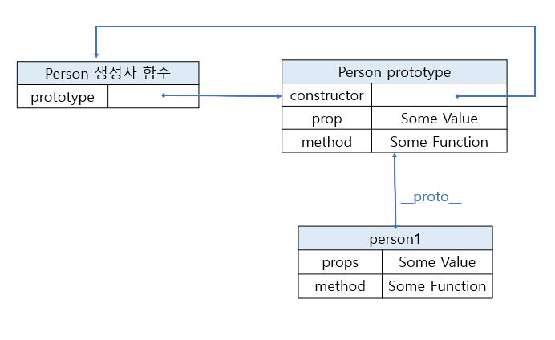

# 6장 객체 지향 프로그래밍
 > 객체 프로퍼티의 이해
 > 객체의 이해와 생성
 > 상속의 이해 

 ##### 객체 지향 (Object Oriented:OO)언어
  : 클래스를 통해 같은 프로퍼티와 메서드를 가지는 객체를 여러개 만든다. 
  - ECMAScript 에서 객체
    - "프로퍼티의 순서 없는 컬렉션이며, 각 프로퍼티는 원시 값이나 객체, 함수를 포함한다" 라고 정의.
    - 객체는 이름-값 쌍의 그룹이며, 각 값은 데이터나 함수가 될 수 있다.
    - 모든 객체는 참조 타입을 바탕으로 생성.
### 6.1 객체에 대한 이해
 - 객체 생성 방법 1 - Object 인스턴스 생성.
    ```js
    var person = new Object();
    person.name = "Nicholas";
    person.age = 29;
    person.job = "Software Engineer";
    person.sayName = function(){
    console.log(this.name);
    };

    person.sayName();
    ```
 - 객체 생성 방법 2 - 객체 리터럴
    ```js
    var person = {
      name : "Nicholas",
      age : 29,
      job : "Software Engineer",
      sayName : function() {
        console.log(this.name);
      }
    };
    ```
#### 6.1.1 프로퍼티 타입
- 프로퍼티 속성 (프로퍼티 어트리뷰트)
  > 자바스크립트 엔진은 프로퍼티를 생성할 때 **프로퍼티의 상태**를 나타내는 프로퍼티 어트리뷰트를 기본 값으로 정의한다.
- 프로퍼티 상태
  - 프로퍼티의 값, 값의 갱신 여부(writable), 열거 가능 여부(enumerable), 재정의 가능 여부(configurable)
- 자바스크립트 엔진 내부에서 구현하며 직접적으로 접근할 방법이 없음.
> `[[속성명]]` : 속성 이름을 대괄호로 감싸 내부 속성임을 나타냄.
- 프로퍼티 구분
  1. 데이터 프로퍼티(data property) 
  2. 접근자 프로퍼티(accessor property) 
  
- 데이터 프로퍼티
  - 데이터 값에 대한 단 하나의 위치를 포함하여 이 위치에서 값을 읽고 씀.
  - 키와 값으로 구성된 일반적인 프로퍼티.
    1. `[[Configuable]]` - 해당 프로퍼티를 `delete`를 통해 삭제하거나, 프로퍼티 속성을 바꾸거나 접근자 프로퍼티로 변환할 수 있음을 나타냄. 기본값 : `true`
    2. `[[Enumerable]]` - `for-in`루프에서 해당 프로퍼티를 반환함을 나타냄. 기본값 : `true`
    3. `[[Writable]]` - 프로퍼티의 값을 바꿀 수 있음을 나타냄. 기본값 : `true`
    4. `[[Value]]` - 프로퍼티의 실제 데이터 값을 포함한다. 프로퍼티의 값을 읽는 위치이며, 새로운 값을 쓰는 위치. 기본값 : `undefined`

- `Object.defineProperty()` 메서드
  - 기본 프로퍼티 속성을 변경
  - 프로퍼티를 추가하거나 수정할 객체, 프로퍼티 이름, 서술자(descriptor)객체 세 가지를 매개변수로 받음.
  - 서술자 객체의 프로퍼티는 내부 속성 이름과 1:1로 대응한다.
```js
var person = {};
Object.defineProperty(person, "name", {
    writable: false,
    value: "Nicholas"
});

console.log(person.name);
person.name = "Michael";
console.log(person.name);
```
```js
var person = {};
Object.defineProperty(person, "name", {
    configurable: false,
    value: "Nicholas"
});
console.log(person.name);
delete person.name;
console.log(person.name);
```
```js
var person = {};
Object.defineProperty(person, "name", {
    configurable: false,
    value: "Nicholas"
});

//throws error
Object.defineProperty(person, "name", {
    configurable: true,
    value: "Nicholas"
});
```
- `Object.defineProperty()` 호출 시 configuable, enumerable, writable의 값을  **따로 명시하지 않는다면 기본 값은 `false`임.**

- 접근자 프로퍼티 (accessor property)
  - 데이터 값이 들어있지 않고, `getter`함수와 `setter`함수로 구성된다. - 하나만 있어도 됨.
  - 접근자 프로퍼티를 읽을 때는 `getter`함수가 호출.
  - 접근자 프로퍼티에 쓰기 작업을 할 때는 새로운 값과 함께 `setter`함수를 호출하며 이 함수가 데이터를 어떻게 사용할 지 결정한다.
- 접근자 프로퍼티 네 가지 속성
  1. `[[Configuable]]` - 해당 프로퍼티가 delete를 통해 삭제하거나, 프로퍼티 속성을 바꾸거나 접근자 프로퍼티로 변환할 수 있음을 나타냄. 기본값 : `true`
  2. `[[Enumerable]]` - `for-in`루프에서 해당 프로퍼티를 반환함을 나타냄. 기본값 : `true`
  3. `[[Get]]` - 프로퍼티를 읽을 때 호출할 함수. 기본값: `undefined`. 매개변수 없음
  4. `[[Set]]` - 프로퍼티를 바꿀 때 호출할 함수. 기본값: `undefined`,, 매개변수 하나 (value)
- 접근자 프로퍼티를 명시적으로 정의할 수는 없으며, `Object.defineProperty()`를 사용해야함. 
   >  객체 리터럴로 설정하는 방법도 있음. 
```js
var book = {
    _year: 2004,
    edition: 1
};
  
Object.defineProperty(book, "year", {
    get: function(){
        return this._year;
    },
    set: function(newValue){
        if (newValue > 2004) {
            this._year = newValue;
            this.edition += newValue - 2004;
        
        }
    }
});

book.year = 2005;
console.log(book.edition);   //2

```
 - `_year` 의 밑줄(_) 은 객체 외부에서 접근하지 않겠다는 의도를 나타낼 때 쓰는 표기법.
 - `getter`함수만 지정 시 해당 프로퍼티는 **읽기 전용**이 되고 수정하는 시도는 무시됨.
 - `setter`함수만 지정 시 프로퍼티를 읽으려 하면 `undefined` 반환.

- 객체 리터럴로 접근자 프로퍼티 설정 방법
   - 객체 리터럴 안에서` getter`와 `setter` 메서드는 `get`과 `set`으로 나타낼 수 있음.
```js
let obj = {
  get propName() {
    // getter, obj.propName을 실행할 때 실행되는 코드
  },

  set propName(value) {
    // setter, obj.propName = value를 실행할 때 실행되는 코드
  }
};
```
 - `getter` 메서드는 obj.propName을 사용해 프로퍼티를 읽으려고 할 때 실행되고, `setter` 메서드는 obj.propName = value으로 프로퍼티에 값을 할당하려 할 때 실행

#### 6.1.2 다중 프로퍼티 정의
 - `Object.defineProperties()` 메서드
      - 프로퍼티 여러 개를 동시에 수정
      - 매개변수는 프로퍼티를 추가하거나 수정할 객체 , 프로퍼티 이름이 추가 및 수정할 프로퍼티 이름과 대응하는 객체 두 가지.
```js

var book = {};

Object.defineProperties(book, {
    _year: {
        value: 2004
    },
    
    edition: {
        value: 1
    },
    
    year: {            
        get: function(){
            return this._year;
        },
        
        set: function(newValue){
            if (newValue > 2004) {
                this._year = newValue;
                this.edition += newValue - 2004;
            }                  
        }            
    }        
});
    
book.year = 2005;
console.log(book.edition);   //2
```

#### 6.1.3 프로퍼티 속성 읽기
   - `Object.getOwnPropertyDescriptor()` 메서드
      - 원하는 프로퍼티의 서술자 프로퍼티(프로퍼티 디스크립터 PropertyDescriptor 객체)를 읽을 수 있음.
      - 읽어올 프로퍼티가 포함된 객체, 서술자를 가져올 프로퍼티 이름 두 가지 매개변수를 받음.
      - 반환값 : 
        - 접근자 프로퍼티: configurable, enumerable, get, set 을 포함하는 객체
        - 데이터 프로퍼티 : configurable, writable, value 를 포함하는 객체 반환.
```js
var book = {};
Object.defineProperties(book, {
    _year: {
        value: 2004
    },
    edition: {
        value: 1
    },
    year: {            
        get: function(){
            return this._year;
        },
        set: function(newValue){
            if (newValue > 2004) {
                this._year = newValue;
                this.edition += newValue - 2004;
            }                  
        }            
    }        
});
    
var descriptor = Object.getOwnPropertyDescriptor(book, "_year");
console.log(descriptor.value);          //2004
console.log(descriptor.configurable);   //false
console.log(typeof descriptor.get);     //"undefined"

var descriptor = Object.getOwnPropertyDescriptor(book, "year");
console.log(descriptor.value);          //undefined
console.log(descriptor.enumerable);     //false
console.log(typeof descriptor.get);     //"function"
```

####  객체 변경 방지
  - 자바스크립트는 객체의 변경을 방지하는 메서드 + 설정한 제약사항을 확인하는 메서드를 제공함.
  1. 객체 확장 금지
     - `Object.preventExtensions(obj)`
        - 객체에 새로운 프로퍼티 추가 불가.
     - `Object.isExtensible(obj)`
        - 새로운 프로퍼티를 추가하는 게 불가능한 경우 false를, 그렇지 않은 경우 true를 반환
  1. 객체 밀봉
     - `Object.seal(obj)`
       - 새로운 프로퍼티 추가나 기존 프로퍼티 삭제를 막음. 프로퍼티 전체에 configurable: false를 설정하는 것과 동일
     - `Object.isSealed(obj)`
       - 프로퍼티 추가, 삭제가 불가능하고 모든 프로퍼티가 configurable: false이면 true를 반환
  1. 객체 동결
     - `Object.freeze(obj)`
        - 새로운 프로퍼티 추가나 기존 프로퍼티 삭제, 수정을 막음. 프로퍼티 전체에 configurable: false, writable: false를 설정하는 것과 동일
     - `Object.isFrozen(obj)`
       - 프로퍼티 추가, 삭제, 변경이 불가능하고 모든 프로퍼티가 configurable: false, writable: false이면 true를 반환

 ###### 주의사항
  - 프로퍼티는 접근자 프로퍼티(get/set 메서드를 가짐)나 데이터 프로퍼티(value를 가짐) 중 한 종류에만 속함.
  - 한 프로퍼티에 get과 value를 동시에 설정하면 에러가 발생
    ```js
    // Error: Invalid property descriptor.
    Object.defineProperty({}, 'prop', {
      get() {
        return 1
      },

      value: 2
    });
    ```
    ---

### 6.2 객체 생성
 > 객체 생성 시, 같은 인터페이스를 가진 객체를 여러 개 만들 경우 중복 코드 발생.

#### **생성자** 패턴
 > ESCMAScript의 생성자는 특정 타입의 객체를 만드는데 사용. 
 커스텀 생성자를 만들어 원하는 타입의 객체에 필요한 프로퍼티와 메서드를 직접 정의 가능.
- 생성자 함수 (constructor)
  - `new 연산자`와 함께 호출하여 객체(인스턴스) 를 생성하는 함수. 
- 인스턴스(instance)
  - 생성자 함수에 의해 생성된 객체

```js
function Person(name, age, job){
    this.name = name;
    this.age = age;
    this.job = job;
    this.sayName = function(){
        console.log(this.name);
    };    
}

var person1 = new Person("Nicholas", 29, "Software Engineer");
var person2 = new Person("Greg", 27, "Doctor");
```
  
- 함수 Person의 이름 첫 글자가 대문자로 시작 
- 생성자는 항상 대문자로 시작하고 아닌 함수는 소문자로 시작하는 표기법.

 - `constructor` 프로퍼티
   - 객체의 타입을 파악하려는 의도. 
   - 두 인스턴스의 constructor 프로퍼티는 Person을 가리킴
   - 타입을 알아내는 목적으로는 `instanceof 연산자`가 안전하다.

 - 함수로서의 생성자.
  > 생성자는  함수이며, `new` 연산자와 함께 호출한 함수는 생성자처럼 동작.
  > `new` 없이 호출 시 일반 함수처럼 동작한다.
  ```js
  function Person(name, age, job){
      this.name = name;
      this.age = age;
      this.job = job;
      this.sayName = function(){
          console.log(this.name);
      };
  }

  // 생성자로 사용
  var person = new Person("Nicholas", 29, "Software Engineer");
  person.sayName();   //"Nicholas"

  // 함수로 호출
  Person("Greg", 27, "Doctor");  //adds to window
  window.sayName();   //"Greg"

  // 다른 객체의 스코프에서 호출.
  var o = new Object();
  Person.call(o, "Kristen", 25, "Nurse");
  o.sayName();    //"Kristen"
  ```

 - 생성자 함수의 인스턴스 생성 과정
    1. 인스턴스 생성과 this 바인딩
        - 암묵적으로 빈 객체 생성.
        - 빈 객체가 인스턴스가 됨.
        - 인스턴스는 this 에 바인딩
    2. 인스턴스 초기화
        - 함수에 기술되어 있는 코드가 실행.
        - 인스턴스 초기화. 
        - 프로퍼티나 메서드를 추가. 생성자 함수가 전달받은 초기값을 할당 등.
    3. 인스턴스 반환
        - 완성된 인스턴스가 바인딩 된 this 반환.

    ```javascript
    function Circle(radius) {
      // 1. 암묵적으로 인스턴스가 생성되고 this에 바인딩

      // 2. this에 바인딩되어 있는 인스턴스를 초기화
      this.radius = radius;
      this.getDiameter = function () {
        return 2 * this.radius;
      };

      // 3. 암묵적으로 this를 반환
      // 명시적으로 원시값을 반환하면 원시값 반환은 무시되고 암묵적으로 this가 반환된다.
      return 100;
    }

    // 인스턴스 생성.
    const circle = new Circle(1);
    console.log(circle); 
    ```
 - 생성자 함수 내 리턴값
   - 암묵적으로 this 반환
   - 원시값을 반환하면 무시되고 this 반환
   - 객체를 반환하면 this반환이 무시됨.
  
#### 내부 메서드 `[[Call]]` 과 `[[Construct]]`
  함수 선언문, 함수 표현식으로 정의한 함수는 **1. 일반 함수로 호출**, **2. 생성자 함수로서 호출** 가능하다.
- 함수 객체만을 위한 내부 슬롯
  - 함수는 `[[Call]]`, `[[Construct]]` 같은 내부 메서드를 추가로 가지고 있음.
  - 함수가 일반함수로 호출 시 내부 메서드 `[[Call]]` 이 호출
  - 생성자 함수로 호출 시 내부 메서드 `[[Construct]]` 호출

- 모든 함수가  `[[Construct]]` 를 갖진 않음.
- `[[Construct]]` 를 갖는 함수 객체를 constructor (=생성자로서 호출할 수 있는 함수), 갖지 않는 함수 객체를 non-constructor (=생성자로서 호출할 수 없는 함수),라고 부른다.
- 함수 객체는 constructor일 수도 있고, non-constructor일 수도 있다.

- `constructor` 와 `non-constructor` 의 구분.
  - constructor: 함수 선언문, 함수 표현식, 클래스
  - non-constructor: **메서드**(ES6메서드 축약 표현), 화살표 함수.  
- **메서드** 인정 범위
  - ES6의 메서드 축약 표현만 의미함. 
- non-constructor인 함수 객체를 생성자 함수로서 호출 시 에러 발생.

```javascript
// 일반 함수 정의: 함수 선언문, 함수 표현식
function foo() {}
const bar = function () {};
// x : 일반 함수로 정의된 함수. ES6 메서드 축약 표현이 아님.
const baz = {
  x: function () {}
};

// constructor
new foo();   // -> foo {}
new bar();   // -> bar {}
new baz.x(); // -> x {}

// 화살표 함수
const arrow = () => {};

new arrow(); // TypeError: arrow is not a constructor

// ES6의 메서드 축약 표현
const obj = {
  x() {}
};

new obj.x(); // TypeError: obj.x is not a constructor
```

#### **프로토타입** 패턴
 > 모든 함수는 `prototype` 프로퍼티를 가짐.
 생성자를 호출할 때 생성되는 객체의 프로토타입이다.
 프로토타입의 프로퍼티와 메서드는 **객체 인스턴스 전체에서 공유**된다.
```js
function Person(){
}

Person.prototype.name = "Nicholas";
Person.prototype.age = 29;
Person.prototype.job = "Software Engineer";
Person.prototype.sayName = function(){
    console.log(this.name);
};

var person1 = new Person();
person1.sayName();   //"Nicholas"

var person2 = new Person();
person2.sayName();   //"Nicholas"

console.log(person1.sayName == person2.sayName);  //true
```
 - 생성자 함수는 비어 있지만, 생성자를 호출해 만든 객체에 프로퍼티와 메서드가 존재. 
 - 프로퍼티와 메서드를 모든 인스턴스로에서 **공유**하게됨.
##### _**프로토타입**은 어떻게 동작하는가_
-   
    - 모든 함수는 `prototype` 프로퍼티를 가짐.
    - 모든 프로토타입은 자동으로 `constructor`프로퍼티를 가짐. 
    - `constructor` : 해당 프로토타입이 프로퍼티로서 소속된 함수.
    - `Pesron.prototype.constuctor` 는 `Person`.
    - 생성자를 호출해서 인스턴스를 생성할 때마다 인스턴스 내부에는 생성자의 **프로토타입을 가리키는 포인터  `[[Prototype]]`** 이 생성됨.
    - `[[Prototype]]` : `__proto__` 프로퍼티를 통해 접근.
    - 인스턴스와 직접 연결되는 것은 생성자의 프로토타입이지 생성자 자체가 아니다.
    - 객체 사이에 프로토타입 연결이 존재하는지 `isPrototypeOf()` 메서드를 통해 알 수 있다. 
    - `Object.getPrototypeOf()` :  `[[Prototype]]`의 값을 반환
  
  - 
    ```js
    function Person(){
    }

    Person.prototype.name = "Nicholas";
    Person.prototype.age = 29;
    Person.prototype.job = "Software Engineer";
    Person.prototype.sayName = function(){
        console.log(this.name);
    };

    var person1 = new Person();
    var person2 = new Person();

    person1.name = "Greg";
    console.log(person1.name);   //"Greg"  from instance
    console.log(person2.name);   //"Nicholas"  from prototype

    delete person1.name;
    console.log(person1.name);   //"Nicholas" - from the prototype
    ```

  - 프로토타입 프로퍼티와 같은 이름의 프로퍼티 추가 시 해당 프로퍼티는 인스턴스에 추가됨.
  - 인스턴스 프로퍼티가 프로토타입 프로퍼티를 '가린다'
  - 인스턴스 프로퍼티를 `delete`하면 프로토타입의 프로퍼티에 접근 가능.
 - `hasOwnProperty()`
   - 프로퍼티가 **인스턴스에 존재**하는 지 확인하는 메서드.
 - `in 연산자 `
    - 주어진 이름의 프로퍼티를 객체에서 접근할 수 있을 때, 
    - 해당 프로퍼티가 인스턴스에 존재하든 프로토타입에 존재할 때 true 반환.

    ```js
    function Person(){
    }

    Person.prototype.name = "Nicholas";
    Person.prototype.age = 29;
    Person.prototype.job = "Software Engineer";
    Person.prototype.sayName = function(){
        console.log(this.name);
    };

    var person1 = new Person();
    var person2 = new Person();

    console.log(person1.hasOwnProperty("name"));  //false
    console.log("name" in person1);  //true

    person1.name = "Greg";
    console.log(person1.name);   //"Greg"  from instance
    console.log(person1.hasOwnProperty("name"));  //true
    console.log("name" in person1);  //true

    console.log(person2.name);   //"Nicholas"  from prototype
    console.log(person2.hasOwnProperty("name"));  //false
    console.log("name" in person2);  //true

    delete person1.name;
    console.log(person1.name);   //"Nicholas" - from the prototype
    console.log(person1.hasOwnProperty("name"));  //false
    console.log("name" in person1);  //true
    ```

- _프로토타입의 대체 문법_
  - 모든 프로퍼티와 메서드를 담은 객체 리터럴로 프로토타입을 덮어쓸 수 있음.
 - constructor 프로퍼티가 Person을 가리키지 않음
```js
function Person(){
}

Person.prototype = {
    name : "Nicholas",
    age : 29,
    job: "Software Engineer",
    sayName : function () {
        console.log(this.name);
    }
};

var friend = new Person();

console.log(friend instanceof Object);  //true
console.log(friend instanceof Person);  //true
console.log(friend.constructor == Person);  //false
console.log(friend.constructor == Object);  //true
```

- _프로토타입의 동적 성질_
  - 프로토타입에서 값을 찾는 작업은 런타임 검색임.
  - 프로토타입 값이 바뀌면 인스턴스에서도 변경된 프로토타입을 참조함.
```js
function Person(){
}

var friend = new Person();
        
Person.prototype = {
    constructor: Person,
    name : "Nicholas",
    age : 29,
    job : "Software Engineer",
    sayName : function () {
        console.log(this.name);
    }
};

friend.sayName();   //error
```
  - `[[Prototype]]` 포인터
    - 생성자가 호출될 때 할당되므로, 프로토타입을 바꾸면 생성자와 원래 프로토타입 사이의 연결이 끊어짐.
    - 생성자의 프로토타입 변경 후 생성한 인스턴스는 새로운 프로토타입을 참조하지만, 그 이전에 생성한 인스턴스는 바꾸기 전의 프로토타입을 참조한다.
- _프로토타입 패턴으로 객체 생성 시의 문제점_ : 공유
  > 프로토타입 패턴이 함수에는 이상적이다, 원시값의 경우 할당 시 prototype 프로퍼티를 가림.
  - 문제점 : 프로퍼티가 참조값 인 경우 모든 인스턴스에서 공유하게 됨. 
#### **생성자 패턴**과 **프로토타입 패턴**의 조합
  - 생성자 패턴으로 인스턴스 프로퍼티를 정의 후 프로토타입 패턴으로 메서드와 공유 프로퍼티를 정의.
  - 자신만의 인스턴스 프로퍼티를 가지고 메서드는 공유한다.
    ```js
    function Person(name, age, job){
        this.name = name;
        this.age = age;
        this.job = job;
        this.friends = ["Shelby", "Court"];
    }

    Person.prototype = {  
        constructor: Person,
        sayName : function () {
            console.log(this.name);
        }
    };

    var person1 = new Person("Nicholas", 29, "Software Engineer");
    var person2 = new Person("Greg", 27, "Doctor");

    person1.friends.push("Van");

    console.log(person1.friends);    //"Shelby,Court,Van"
    console.log(person2.friends);    //"Shelby,Court"
    console.log(person1.friends === person2.friends);  //false
    console.log(person1.sayName === person2.sayName);  //true

    ```

###### 참고
 - [프로퍼티 getter와 setter](https://ko.javascript.info/property-accessors)
 - [프로퍼티 플래그와 설명자](https://ko.javascript.info/property-descriptors)
 - [new연산자와 생성자 함수](https://ko.javascript.info/constructor-new#ref-37)
  - "모던 자바스크립트 Deep Dive" 책
